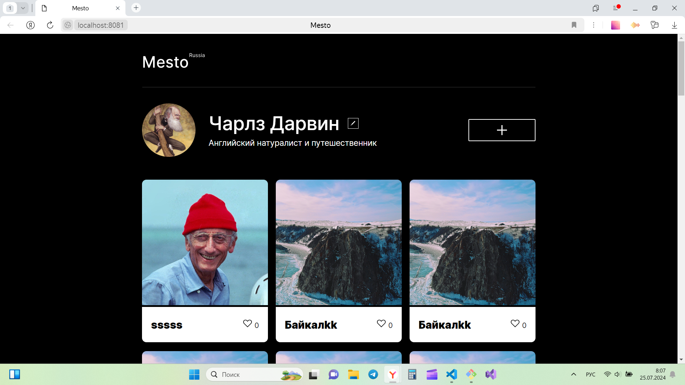

# Проектная работа Mesto

#### Ссылка на GitHub
https://github.com/ElenaNekhoroshikh/mesto-project-ff.git

#### Этот проект выполнен в рамках обучения в Яндекс.Практикуме.  Проект представляет собой веб-приложение для обмена фотографиями мест.  Пользователи могут редактировать свой профиль, добавлять новые места,  ставить лайки другим местам и удалять их.
### Вы можете ознакомиться с демонстрацией проекта по [ссылке](https://elenanekhoroshikh.github.io/mesto-project-ff/ "Мой сайт!").

#### Функциональность в проекте:
* Реализовано создание и удаление карточки с помощью JavaScript.
* Создано инфраструктурное окружение с помощью Webpack;
* Код разбит на отдельные модули;
* Реализована работа модальных окон редактирования профиля,  добавления карточки и превью фотографии,  а также действие лайка на карточке;
* Разработана валидация для всех форм;
* Интерфейс подключен к API;
* Получившийся сайт опубликован на сервере.

#### Технологии
* HTML
* CSS
* JavaScript
* API